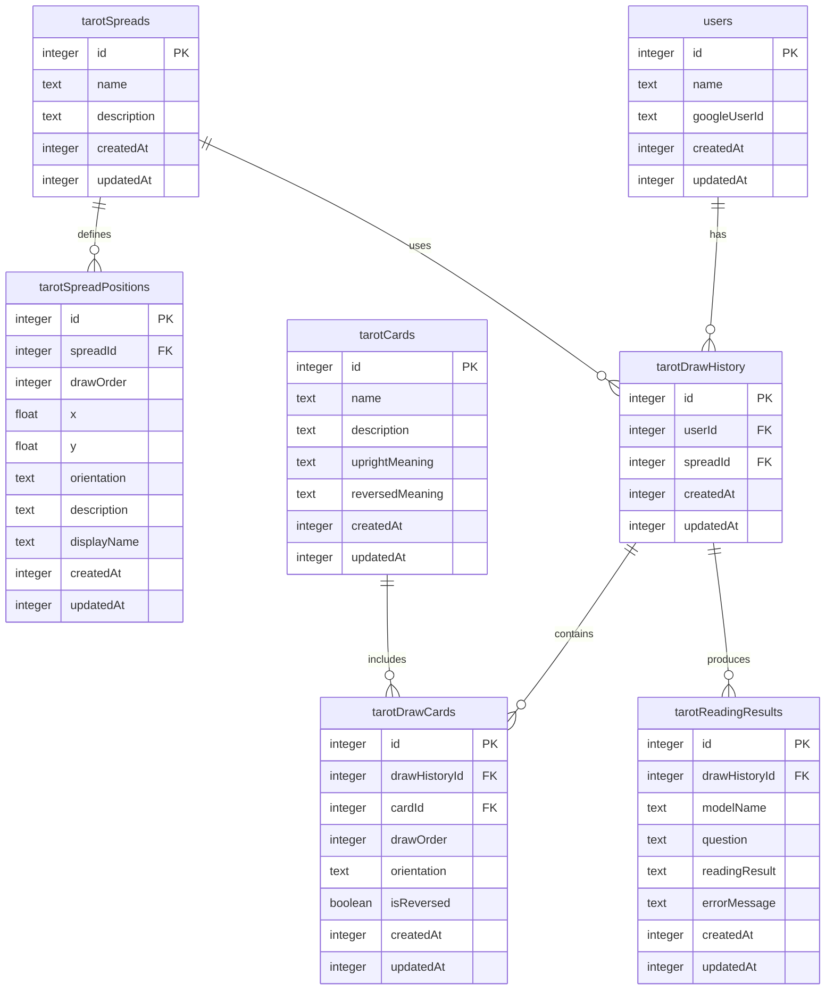

https://chatgpt.com/share/67331eee-19b8-800f-893e-8ea666b326b6

```mermaid
erDiagram
    users {
        integer id PK
        text name
        text googleUserId
        integer createdAt
        integer updatedAt
    }

    tarotSpreads {
        integer id PK
        text name
        text description
        integer createdAt
        integer updatedAt
    }

    tarotSpreadPositions {
        integer id PK
        integer spreadId FK
        integer drawOrder
        float x
        float y
        text orientation
        text description
        text displayName
        integer createdAt
        integer updatedAt
    }

    tarotCards {
        integer id PK
        text name
        text description
        text uprightMeaning
        text reversedMeaning
        integer createdAt
        integer updatedAt
    }

    tarotDrawHistory {
        integer id PK
        integer userId FK
        integer spreadId FK
        integer createdAt
        integer updatedAt
    }

    tarotDrawCards {
        integer id PK
        integer drawHistoryId FK
        integer cardId FK
        integer drawOrder
        text orientation
        boolean isReversed
        integer createdAt
        integer updatedAt
    }

    tarotReadingResults {
        integer id PK
        integer drawHistoryId FK
        text modelName
        text question
        text readingResult
        text errorMessage
        integer createdAt
        integer updatedAt
    }

    users ||--o{ tarotDrawHistory : "has"
    tarotSpreads ||--o{ tarotDrawHistory : "uses"
    tarotSpreads ||--o{ tarotSpreadPositions : "defines"
    tarotDrawHistory ||--o{ tarotDrawCards : "contains"
    tarotCards ||--o{ tarotDrawCards : "includes"
    tarotDrawHistory ||--o{ tarotReadingResults : "produces"

```
